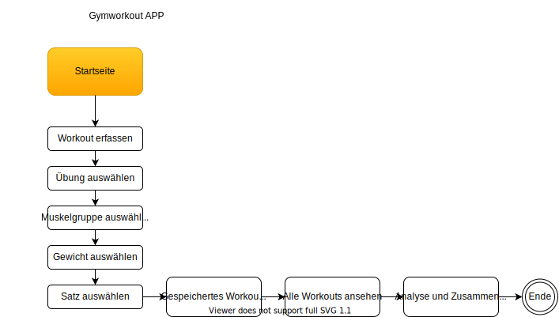
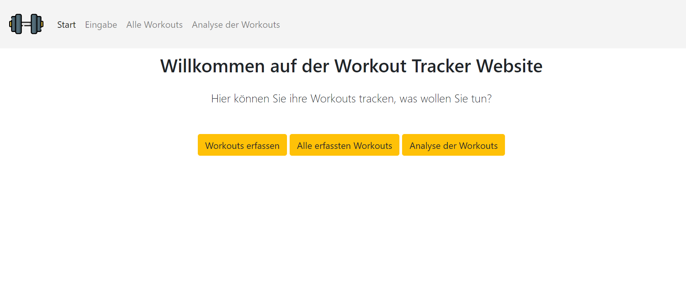
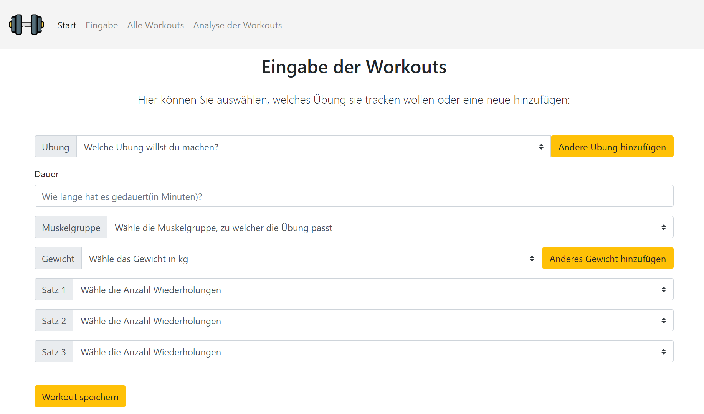
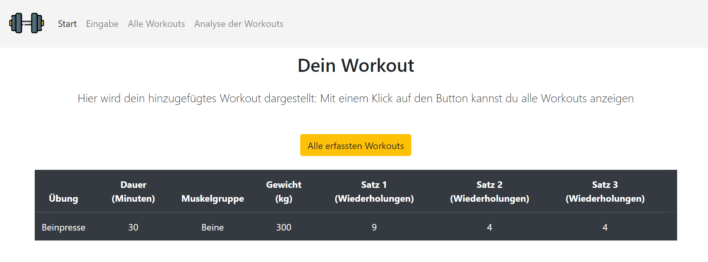
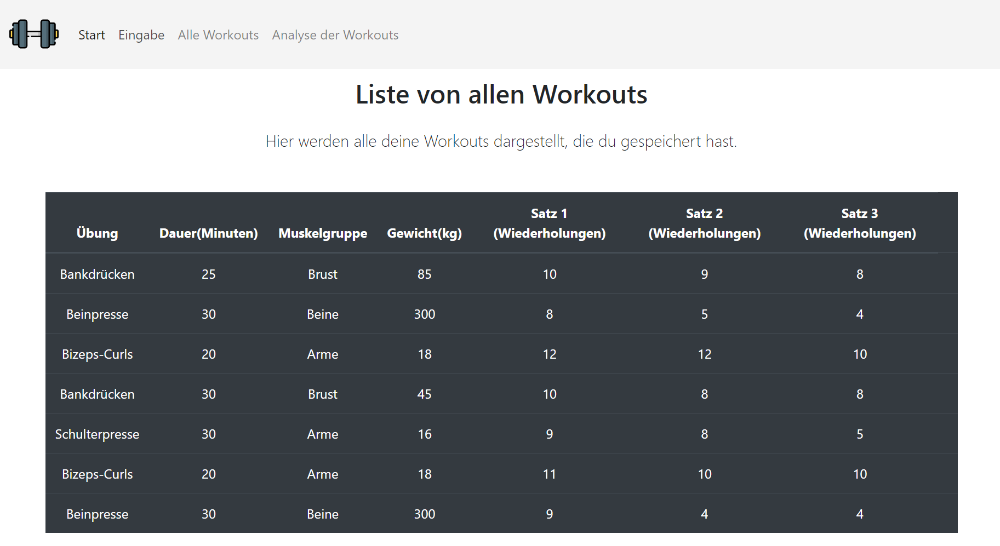
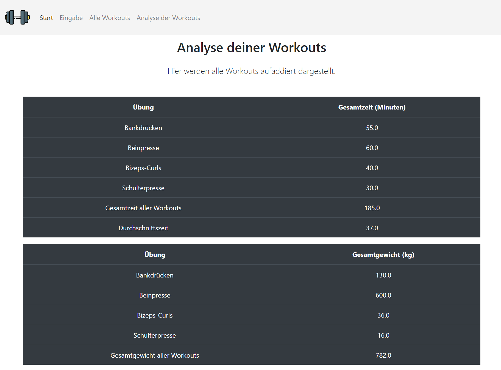

# Gym / Workout Tracker mit Flask und Python

Das Tracken der Gewichte und Übungen im Gym ist ein grosses Problem.

Vor allem diese Probleme ergeben sich:

1. 🧐 **Keine Übersicht über alle Übungen** - mit dieser App können beliebige Übungen hinzugefügt werden.
2. 🏋 **Keine Übersicht über Wiederholungen** - mit dieser App kann die Wiederholungsanzahlt gespeichert werden.
3. 💨 **Keine Übersicht über die Zeitdauer** - mit dieser App kann die Zeit eigegeben werden.
4. 🔩 **Keine Übersicht über die verwendeten Gewichte** - mit dieser App kann das genaue Gewicht festgehalten werden.
## Workflow 

##### Einer der ersten Entwürfe, darum stimmt es nicht zu 100% mit dem jetzigen Projekt überein.
## Walkthrough:
1. Auf der Startseite kann man zwischen Workouts erfassen, alle Workouts und Analyse der Workouts auswählen. Benutzt man 
die App zum ersten Mal erfasst man am besten ein neues Workout. 

2. Klickt man auf Workout erfassen, kann ein neues Workout/Übung hinzugefügt werden.
Dabei wird immer ein Dropdown agezeigt ausser bei der Dauer. Diese muss per Tastatur eingegeben werden. 
Ist die Übung, welche man machen will noch nicht im Dropdown vorhanden, dann kann man diese mit Klick auf den 
Button "Andere Übung hinzufügen" hinzufügen. Dann erhält man ein Textfeld, in welches man den Namen der neuen 
Übung hinzufügen kann. Die Eingabe muss mit dem Button "Neue Übung hinzufügen" bestätigt werden, dann wird man wieder
auf die Eingabeseite weitergeleitet. Im Dropdown der Übungen kann dann die hinzugefügte Übung ausgewählt werden.
Ähnlich verhält es sich bei den Gewichten. Bei den Dropdown der Gewicht kann in Kilos das benutzte Gewicht gewählt 
werden. Die standartmässige Auswahl geht von 1-20 Kilo. Hat man mit mehr Gewicht trainiert, kann mann dies per Klick auf
"Anderes Gewicht hinzufügen" hinzufügen. Wird "Anderes Gewicht hinzufügen" ausgewählt, dann wird man auf eine neue Seite 
weitergeleitet, auf welcher man das neue Gewicht eingeben kann und mit dem Button "Neues Gewicht hinzufügen" bestätigen musss.
Das neue Gewicht wird dann im Gewichtdropdown angezeigt und kann ausgewählt werden.
Wurden für alle Felder etwas ausgewählt, dann muss man auf den Button "Workout speichern" klicken.
Auf Klick kommt man auf die Seite "Dein Workout".

3. Auf der Seite "Dein Workout" können die Details des hinzugefügten Workouts angezeigt werden. Und man kann auf den
Button "Alle erfassten Workouts" klicken.

4. Mit Klick auf "Alle erfassten Workouts" werden alle bereits erfassten Workouts/Übungen in einer Liste dargestellt.

5. Um die Auswertung der Workouts zu sehen, muss man auf "Analyse der Workouts" klicken. Hier werden alle Workouts 
zusammengefasst dargestellt, das heisst hat man mehrmals die gleiche Übung gemacht, werden diese addiert und nur einmal in der Liste
angezeigt. Ausserdem wird die Gesamtzeit, Durchschnittszeit und das Totale Gesamtgewicht dargestellt.
